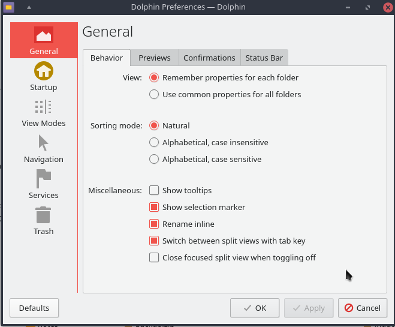

# Dolphin split view : The right way

KDE Plasma's File Manager, **Dolphin**, patched for having normal behavior of the F3 key (the split view): The F3 key closes the opposite pane in split view instead of the focused. 

With this patch:  
When you close the split view hitting F3 a second time, it is the opposite pane that disappears, <u>not the focused view</u> (which is the default behavior in Dolphin, as opposite to every other Window Manager).

# The option is configurable

Additionnaly It's UI friendly, a new checkbox in configuration to control that option:
Menu **General/Behavior/Misc**.

See below the checkbox "Close focused split fiew when toggling off".

  

it's turned on by default because it's what most KDE users probably prefer (since it's the default and unchangeable until now)

# Notes 

I am publishing an AUR package because the KDE team surprisingly did not accept the change, even if it could be disabled by default & by configuration.

Apparently, the behavior of split view is a discussed since 2013, some people prefer to close focused, others prefer to close unfocused, and even others prefer to close the right view no matter what. And some people are against adding the option of controlling this behavior.

More about that : 

- [how to change the behavior of F3 (Dolphin split view) • KDE Community Forums](https://forum.kde.org/viewtopic.php?f=223&t=151449&p=408772#p408772)
- [Dolphin: F3 (split view) Verhalten ändern ?](https://forum.kde.org/viewtopic.php?f=224&t=111065&p=408775#p408775 "")
- [312834 – closing split view closes the currently focused view instead of the inactive](https://bugs.kde.org/show_bug.cgi?id=312834 "")

# Credits

Angelo Everton Nascimento de Oliveira Júnior 
